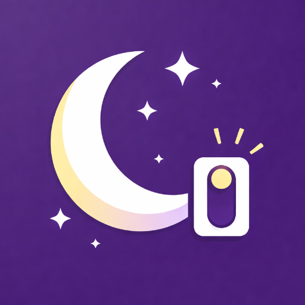
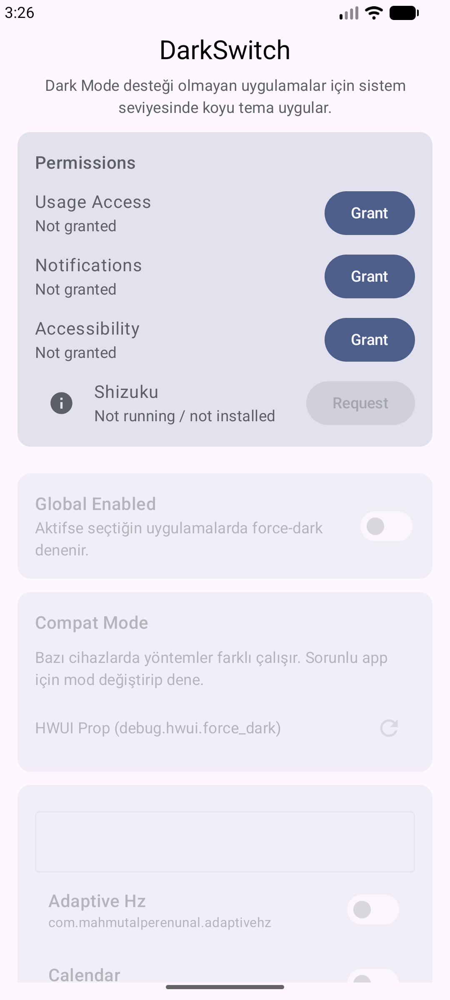
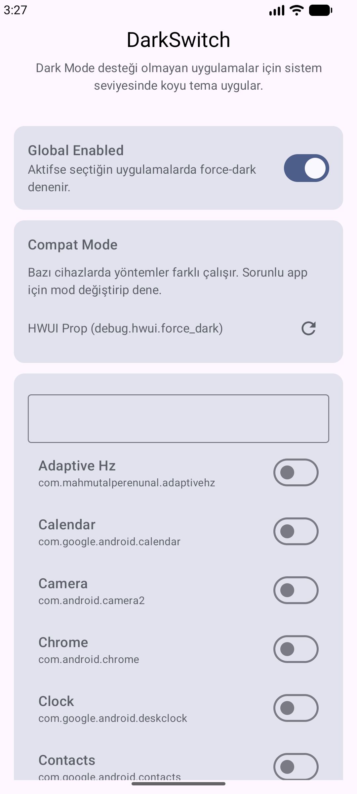
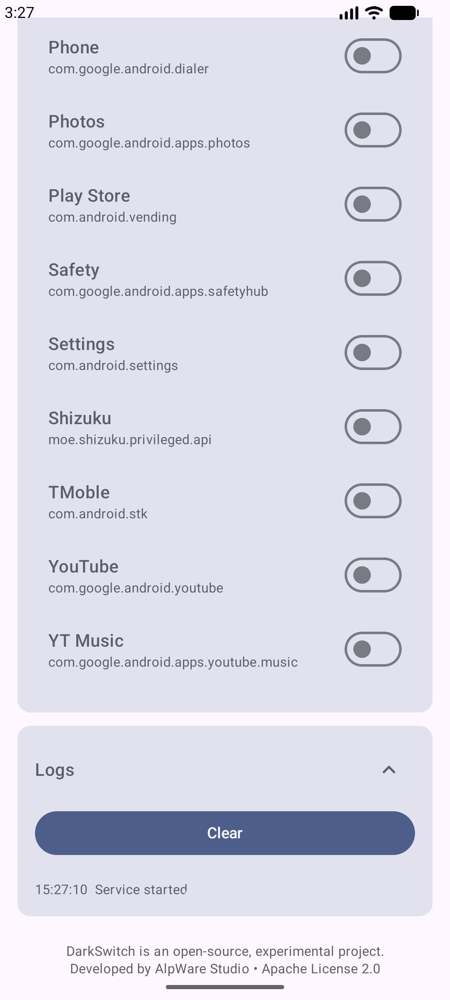

# 🌙 DarkSwitch

  

**DarkSwitch** is a free and open-source Android application that attempts to apply a **system-level dark theme** to apps that **do not natively support Dark Mode**.

This project is **not intended for the Play Store**.  
It is designed for **technical users, power users, and developers**.

---

## ✨ Features

- 🌑 Attempts to force Dark Mode on apps without native support
- 📱 **Per-app enable / disable** (not global only)
- ⚙️ Multiple **compatibility modes**
- 🔍 Real-time **foreground app detection**
- 🔐 **No root required**
- 🧩 Uses **Shizuku** for privileged system access
- 🧪 Built-in **logs** for debugging and testing
- 🧼 Minimal **Material 3 / Material You** UI

---

## 📸 Screenshots

  
  
  

---

## ⚠️ Important Notes (Please Read)

> DarkSwitch is **NOT** equivalent to browser extensions like **Dark Reader**.

DarkSwitch relies on Android’s **built-in force-dark mechanisms** (HWUI / system settings).  
Because of this:

- ❌ It may **not work on all apps**
- ❌ Some apps explicitly **block force-dark**
- ❌ Many **system apps** (Settings, Launchers, etc.) ignore force-dark
- ❌ Behavior may vary across devices and Android versions
- ⚠️ Android emulators often **do not support force-dark properly**

**For reliable results, test on a real Android device.**

---

## 🔐 Why These Permissions Are Required

DarkSwitch requires the following permissions to function correctly:

### 1️⃣ Accessibility Service
- **Purpose:**  
  Detect which app is currently in the foreground.
- **What it does NOT do:**
    - No touch interaction
    - No text reading
    - No data collection

> Only `event.packageName` is used.

---

### 2️⃣ Shizuku
- **Purpose:**  
  Apply system-level settings without root access.
- **How it works:**  
  Shizuku provides ADB-level permissions via a local service.
- **Root is NOT required.**

---

### 3️⃣ Usage Access (optional / fallback)
- Used only as a secondary mechanism on some devices.
- Accessibility is the primary method.

---

### 4️⃣ Notification Permission
- Required for the **foreground service notification**.
- Used only to indicate that DarkSwitch is running.

---

## 🚀 Installation

### 1) Install via APK
- Download the APK from **GitHub Releases**
- Allow installation from unknown sources
- Install the APK

### 2) Set up Shizuku
- Install **Shizuku** from Google Play (RikkaApps)
- Start Shizuku:
    - Android 11+: usually requires **Wireless Debugging**
- In DarkSwitch, tap **Request** to grant permission

### 3) Enable Accessibility
- System Settings → Accessibility
- Enable **DarkSwitch Foreground Tracker**

---

## 🧪 How to Use

1. Grant all required permissions
2. Enable **Global Enabled**
3. Toggle a target app **ON**
4. Open the target app
5. If needed, switch **Compat Mode** and retry

---

## 🛠️ What Is Compat Mode?

Different devices handle force-dark differently.

DarkSwitch provides multiple methods:
- HWUI system property
- Global system settings
- UI mode command execution

If an app does not respond, try switching modes.

---

## 🧠 For Developers

- Jetpack Compose
- DataStore
- StateFlow / Flow
- Foreground Service
- AccessibilityService
- Shizuku API

The project is designed to be **modular, readable, and hackable**.

---

## 🔍 Logs

The built-in log viewer shows:
- Detected foreground app
- Applied compat mode
- Success / failure results

Useful for debugging and experimentation.

---

## 🔓 License

This project is licensed under the **Apache License 2.0**.

- Commercial use allowed
- Forking and modification allowed
- No warranty provided

See [`LICENSE`](LICENSE) for details.

---

## ⚠️ Disclaimer

This project is **experimental**.

- You are responsible for any effects on your device or apps.
- This is **not an officially supported Android feature**.
- Behavior may break after system updates or OEM changes.

---

## ❤️ Contributing

Issues, pull requests, and discussions are welcome.  
However, this project is **not intended for Play Store distribution**.

---

**AlpWare Studio**  
Built with curiosity — not promises.